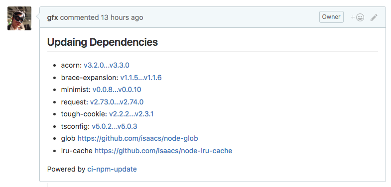

# ci-npm-update [](https://circleci.com/gh/bitjourney/ci-npm-update)

This command keeps npm dependencies up-to-date by making pull-requests from CI.

For example: https://github.com/gfx/ci-npm-update/pull/13



This is inspired by [circleci-bundle-update-pr](https://github.com/masutaka/circleci-bundle-update-pr).

# Install

```sh
npm install --save-dev ci-npm-update
```

# Usage

## Configuration

This command is designed to be executed by CI nightly builds.

Set `GITHUB_ACCESS_TOKEN` environment to make a pull-request to github repositories,
and set SSH keys to push to the repos from CI.

If the CI environment has no git configuration, also set `GIT_USER_NAME` and `GIT_USER_EMAIL`
to commit patches in CI.

```sh
export GITHUB_ACCESS_TOKEN=...
export GIT_USER_NAME=gfx
export GIT_USER_EMAIL=gfx@users.noreply.github.com
```

## Execution

By default, `ci-npm-update` runs in dry-run mode. Set `--execute` to make pull-requests.

```sh
ci-npm-update --execute
```

## Local Tests

If you only run it in dry-run mode, no configuration is required:

```
# run in dry-run mode:
ci-npm-update
```

If you want to make pull-requests in your local machine, use `GITHUB_ACCESS_TOKEN`:

```
# envchain is recommended
envchain --set github GITHUB_ACCESS_TOKEN
# run:
envchain github ci-npm-update --execute
```

# Development

Setup:

```
npm run setup
```

Easy test command in dry-run mode:

```
npm run build && envchain github node bin/ci-npm-update
```

## Heroku Scheduler

If you want to setup heroku schedulers, there's a template for it:

[](https://heroku.com/deploy?template=https://github.com/gfx/ci-npm-update)

To test it, run the following command:

```sh
heroku run './build-circleci'
```

# License

Copyright (c) 2016 Bit Journey, Inc.

Licensed under the Apache License, Version 2.0 (the "License"); you may not use this file except in compliance with the License. You may obtain a copy of the License at

http://www.apache.org/licenses/LICENSE-2.0

Unless required by applicable law or agreed to in writing, software distributed under the License is distributed on an "AS IS" BASIS, WITHOUT WARRANTIES OR CONDITIONS OF ANY KIND, either express or implied. See the License for the specific language governing permissions and limitations under the License.
